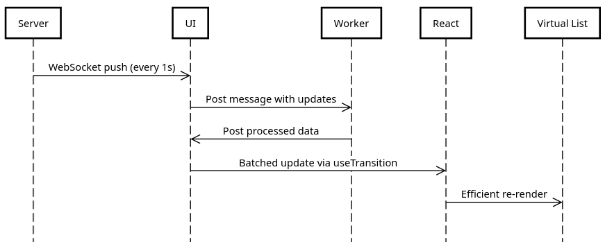
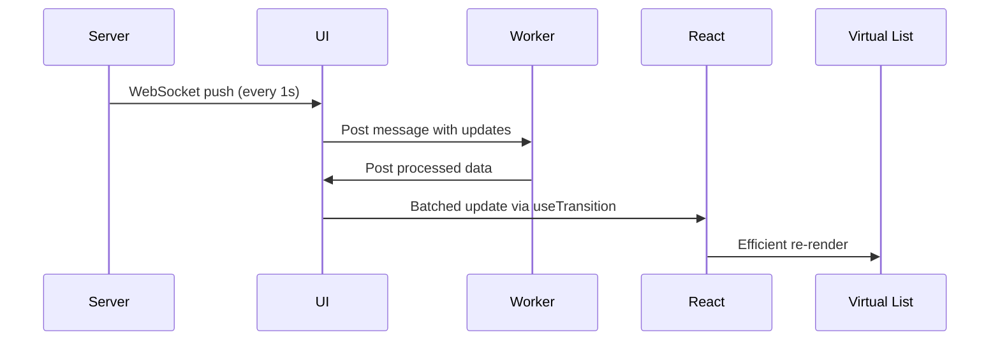

# Phase Two: Project Planning

This document provides a detailed walkthrough of how I planned the project before starting with building it. I will explain each step I took, along with the reasoning behind it.

> **Heads-up:** This will be a **very** text-heavy document. I might skip minor details to keep it concise and easy to digest while focusing on the essential parts.

---

## Clueless Beginning

When I first started this project, I had no idea what the final product would look like. I knew I wanted to build a dashboard application using React, but that was about it.

So, I asked **Deepseek r1** a few clarifying questions. Questions like: _'What should the dummy data look like?'_, _'What all components should the dashboard have?'_, _'What should the layout be?'_.

After getting the answers, I knew I had something to work with. I had a rough idea of what the dashboard should look like and what components it should have along with a decent idea of the Data Structure I will be dealing with.

Here's the dummy Data Structure **Deepseek r1** provided, which is a good starting point:

```json
/*
Device Entry Data-Structure
This is what the IOT devices would send to a real-world production backend.
*/
{
  "id": "a3f7d9c2-4b6e-4f8a-9c0d-3e7b6a1f4d8a",
  "name": "Berlin-Sensor-42",
  "location": {
    "lat": 52.520008,
    "lng": 13.404954
  },
  "metrics": {
    "temperature": 22.5,
    "humidity": 45,
    "battery": 78,
    "signal_strength": -67
  },
  "status": "active",
  "last_updated": "2024-02-20T14:23:45Z"
}
```

I, right away, thought -

_'Could there be a situation where it would require app to update multiple keys of this data structure at once?'_

I again had a follow-up question to myself -

_'Also, event if it is not, wouldn't that be a good feature to work on?'_.

This led me to think about the **Bulk Update** feature.

Some way to allow updates, in bulk, to multiple keys in the data structure at once.

**There I had my very first addition to this Practice Project.**

_(I will be talking more about how the update feature works and the logic behind it once we get to the Web Workers Section)_

I quickly created a dummy update payload data structure just so that I have something that I can refer to/use when I actually start implementing it and here is what I came up with:

```json
/*
Real-Time Update Payload Data-Structure
*/
{
  "id": "a3f7d9c2-4b6e-4f8a-9c0d-3e7b6a1f4d8a",
  "timestamp": "2024-02-20T14:24:00Z",
  "changes": {
    "temperature": 22.7,
    "battery": 77
  }
}
```

This might not address the **Bulk Update** feature yet but it is a good starting point, again, we will see.

## Something to begin with

Now that the data structure for the devices and the update payload was ready, I had a rough idea of what the dashboard should be expecting from the backend, _in our case our mock MirageJS server_.

Next was to plan the layout and the components of the dashboard.

Again, I reached out to **Deepseek r1** for some guidance on what the layout should look like and what components should be there.

It gave me some Mockups and this is what it looks like:

This is how **Deepseek r1**'s Mockup looked like for the Dashboard:

```
┌───────────────────────────────┬───────────────────────┐
|  SEARCH BAR [____________]    |                       |
|  FILTERS:                     |  REAL-TIME GRID       |
|  - Status: [All ▼]            |  (Virtualized)        |
|  - Temperature: 0°C - 50°C    |                       |
|  - Last Updated: [24h ▼]      |                       |
|                               |                       |
├───────────────────────────────┴───────────────────────┤
|  GEO HEATMAP                                          |
|  [Interactive Map with Overlays]                      |
├───────────────────────────────────────────────────────┤
|  METRICS:          FPS: 60 | Rows: 10,342 | Mem: 153MB|
└───────────────────────────────────────────────────────┘
```

This is a huge step forward. I now have a good idea of what the dashboard problem statement asks for and what components it should have.

All I need is some guideance on how the individual components should look like and what should be the layout of the components now.

The **"Search Bar"** and it's associated pieces were clear to me and I had made my mind to make it as a **Collapsable Side Drawer**, and keeping **responsiveness** & **mobile first design** in mind, I had decided that it would be _expanded by default on Larger screens (above Tablets screen size) and Collapsed by default on Smaller screens (Tablets and smaller)_.

**"Metrics"** was a very simple comonent and I had decided I would make it a floating widget that would stick to the bottom of the screen and would be visible at all times (_or maybe add ability to drag and place where-ever needed, I don't know for sure right now, maybe this could be **my second addition to the project**?_).

The two main and th most-important components were the **"Real-Time Grid"** and the **"Geo Heatmap"**.

This is what **Deepseek r1** gave me as a hint for the **"Real-Time Grid"**:

```
┌──────────────────────────────────────────────────────────────────────┐
| ID                | Location       | Temperature | Humidity | Status  |
|-------------------|----------------|-------------|----------|---------|
| #a3f7d9c2 (Berlin)| 52.52°N,13.40°E| 22.5°C ↗    | 45%      | ✅ Active|
| #b5e8f1a6 (Paris) | 48.85°N,2.35°E | 19.8°C →    | 52%      | ⚠️ Weak  |
| ...10k+ rows...   |                |             |          |         |
└──────────────────────────────────────────────────────────────────────┘
```

_... yea it is not perfect but I do get a good idea of what a "Row" of information should look like so I think I will settle with this._

There are nuances to this component as well as Deepseek r1 mentioned that the grid column _"Temperature"_ and _"Humidity"_ should be a **_"Spark Chart"_** that updates in real-time, of course as that is what this interface is all about.

Updating _"Status"_ in real-time is really simple but to test my skills I will try to make it fancy, somehow, we will see (**_contributing to my third addition to the project_**).

**Deepseek r1** also gave me a hint for the **"Geo Heatmap"**:

```
           [World Map Display]
     ...................................
     .        ░▒▓████▓▒░            ░▒▓.
     .    ░▒▓█▓▒░    ░▒▓█▓▒░    ░▒▓█▓▒░.
     .  ░▓█▓▒░          ░▒▓██▓▒░      ░.
     ..░▒▓█▓▒░ EUROPE       ░▒▓██▓▒░...
     --------------------------------
     [Heatmap Legend] 0-25°C ░▒▓██ 26-50°C
```

This was, as the name says, a Heatmap and I had never built anything like this before so I was excited to work on this.

At this point of time, I knew I had to look up a lot of examples about these different components to truly understand the exact look and fell. About the Heatmap, I had no idea how I would tackle that but I was sure that I would be using **Leaflet API** for this or some other similar service that allows me to generate a Heatmap, or maybe something similar?.

Lastly, **Deepseek r1** ended up with a simple flow of control for the applicaiton which cleared a lot of doubts in my head and it all started to make sense.



_Try opening the soure of this diagram in a Markdown viewer that supports Mermaid diagrams, if you can't see it for some reason._



## Summary

At this stage, I felt confident as:

- I had a clear idea of the problem statement.
- Data Structure for the devices and the update payload was clear.
- API Mockups for the components were clear.
- Layout and Components of the Dashboard were clear.
- Control Flow of the Application was clear.

I still had a lot of questions regarding implementations and code modularity and I was sure that I would be able to answer them as I go along. I just need a good clean start with proper separation of concerns and I was sure I would be able to tackle this project.

> _Next up: Remaining Project Setup and MirageJS Server Configuration._
